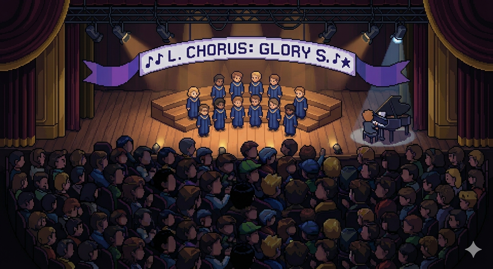

# Eisteddfod NES Simulation

A browser-based NES-style simulation of the Welsh *Eisteddfod* — a traditional festival of music, poetry, and performance — rendered in pixel art with chiptune audio synthesised entirely in JavaScript.

**[Live demo](https://kevinch3.github.io/bythfod/)**



---

## What it is

The simulation runs a continuous show with seven acts, each following the same theatrical flow:

1. **Fade-in** with fanfare
2. **Announcer** introduces the act in Welsh
3. **Performance** plays with NES-style music and animated sprites
4. **Applause** from the audience with raised hands and sparkles
5. **Fade-out** to the next act

### Acts

| # | Welsh title | Type |
|---|-------------|------|
| 1 | Côr Meibion Caernarfon | 12-voice male choir |
| 2 | Adroddiad: "Y Ddraig Goch" | Spoken recitation |
| 3 | Unawdydd: Eirlys Thomas | Soprano solo |
| 4 | Ffidil: Rhys Gwyndaf | Violin solo |
| 5 | Deuawd: Mair & Siôn | Vocal duo |
| 6 | Utgorn: Geraint Jones | Trumpet solo |
| 7 | Finale — Pawb ar y Llwyfan | Grand finale choir |

---

## Controls

| Input | Action |
|-------|--------|
| Click canvas | Start / skip to next act |
| `Space` or `Enter` | Start / skip to next act |
| **▶ DECHRAU** | Start the show |
| **⏭ NESAF** | Skip to next act |
| **🔊 MED** | Cycle volume (MED → LOW → HIGH → MUTE) |

---

## Technical overview

### Audio — `app.js` → `Synth` class

Audio is synthesised in real time using the [Web Audio API](https://developer.mozilla.org/en-US/docs/Web/API/Web_Audio_API) — no audio files are loaded.

| Channel | Waveform | Use |
|---------|----------|-----|
| Pulse 1 | Custom periodic wave (duty 50 %) | Melody |
| Pulse 2 | Custom periodic wave (duty 12.5 %) | Harmony |
| Triangle | `triangle` oscillator | Bass lines, violin |
| Noise | White-noise buffer + bandpass filter | Applause |

Each piece in the `M` object (`choir`, `solo`, `duo`, `violin`, `trumpet`, `recitation`) schedules oscillator events at precise times using `AudioParam` automation, mimicking the NES APU's note-on/note-off envelope.

### Visuals — `app.js` → `Rend` class

Rendered on a `256×224` canvas (NES native resolution), CSS-scaled 3× to `768×672` with `image-rendering: pixelated`.

- **Stage**: procedural floor planks, three-tier risers, swaying curtains, overhead lighting rig with animated beam shafts
- **Spotlights**: radial canvas gradients that change shape by act type (`choir` = wide wash, `duo` = two spots, others = tight centre spot)
- **Sprites**: `person()` draws a 20 px tall character with robe, head, hair, eyes, and feet; instruments are built from `px()` rectangles
- **Audience**: deterministic PRNG (LCG seed 7919) so the audience looks the same each frame; hands are re-seeded each frame to animate applause

### Show flow — `app.js` → `Show` class

A simple state machine advances through phases: `idle → fade-in → announcing → performing → applause → fade-out → (next act)`. Delta time is capped at 100 ms per frame to survive tab switches.

---

## File structure

```
.
├── index.html        # HTML shell — imports CSS and JS
├── style.css         # All layout and UI styles
├── app.js            # Audio engine, renderer, show logic
├── scene_chorus.png  # Reference screenshot (chorus scene)
└── scene_empty.png   # Reference screenshot (empty stage)
```

---

## Running locally

No build step required — open `index.html` directly in any modern browser, or serve with any static file server:

```bash
npx serve .
# or
python3 -m http.server
```

GitHub Pages serves the `main` branch root automatically once enabled in **Settings → Pages → Source → Deploy from branch → main / (root)**.

---

## Browser support

Requires Web Audio API and ES2022 class fields. Works in all modern browsers (Chrome 90+, Firefox 90+, Safari 15+). Does not work in Internet Explorer.
